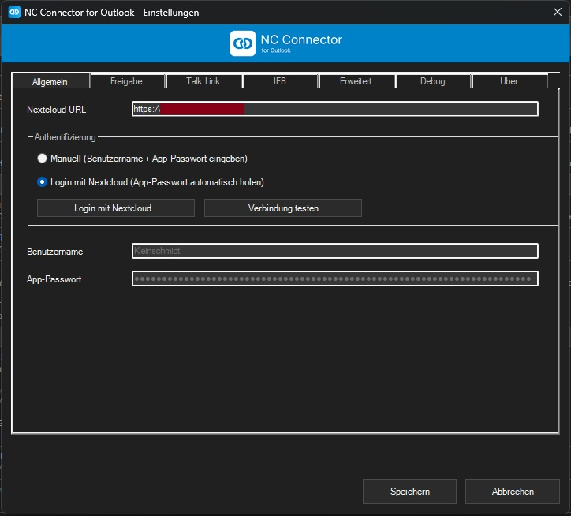
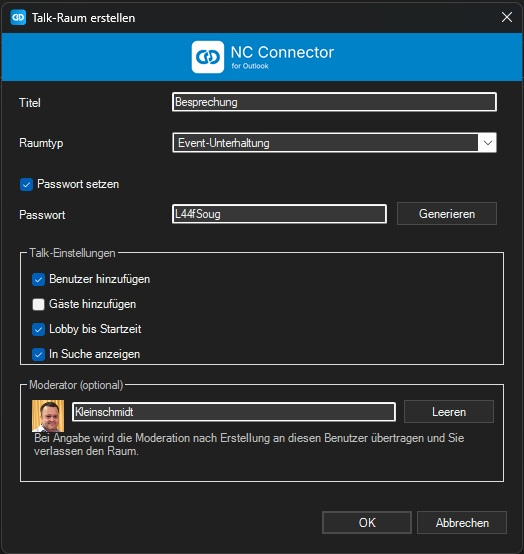
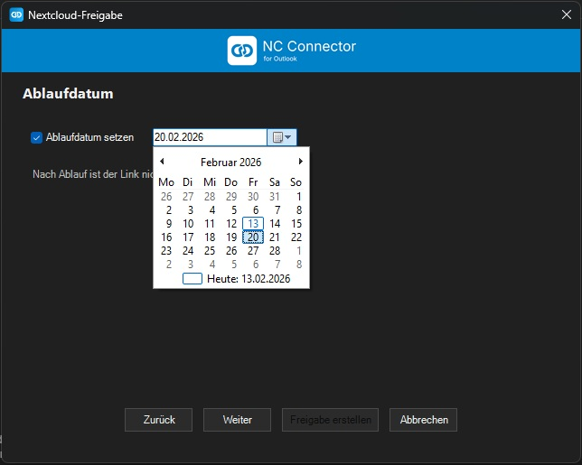
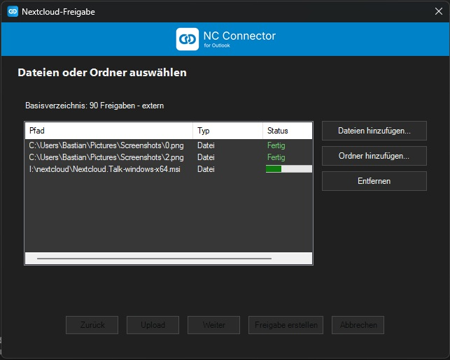
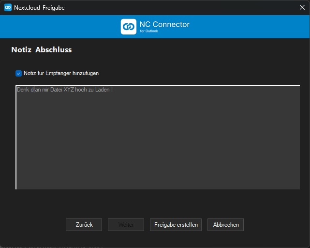
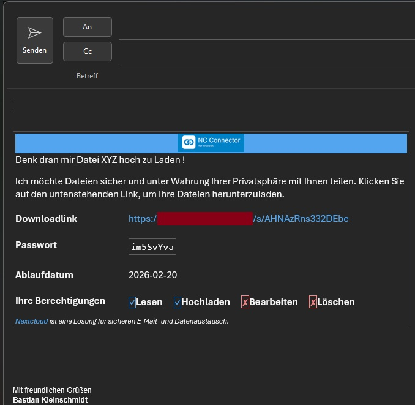



# NC Connector for Outlook

Nextcloud Enterprise for Outlook verbindet Outlook nahtlos mit Ihrer Nextcloud. Das Add-in automatisiert Talk-Raeume fuer Termine, stellt einen lokalen Free/Busy-Proxy bereit und liefert einen leistungsfaehigen Filelink-Assistenten fuer E-Mails. Ziel ist ein professioneller Workflow vom Kalender bis zur Dateiablage -- ohne Medienbruch und mit klarer Administrierbarkeit.

## Kernfunktionen

- **Outlook Ribbon & Explorer-Tab**  
  Eigener Ribbon *Nextcloud Enterprise* mit den Aktionen *Talk-Link einfuegen*, *Einstellungen* sowie *Nextcloud Freigabe hinzufuegen*. Die Einstellungen sind in Tabs gegliedert (Allgemein, Filelink, IFB, Einladungen, Erweitert, Debug, Ueber) und decken alle Optionen ab.

- **Talk-Link Workflow fuer Kalender**  
  Erstellt wahlweise Event-Konversationen (Nextcloud >= 31) oder Standardraeume. Der Dialog deckt Lobby bis Start (Standard aktiv), Sichtbarkeit in der Suche (Standard aktiv) und ein optionales Passwort (>= 5 Zeichen) ab. Nach dem Speichern uebernimmt Outlook Link, Passwort und Hilfetext. Raumtitel und Beschreibung werden zwischen Outlook und Nextcloud synchronisiert; Terminabsagen loeschen verwaiste Raeume automatisch.

- **Intelligentes Lifecycle-Management**  
  Lobby-Updates und Loeschbefehle erfolgen nur, wenn der angemeldete Benutzer Veranstalter ist. Terminverschiebungen aktualisieren automatisch die Lobby-bis-Startzeit; Serien- und Einzeltermine werden sauber unterschieden.

- **Komfortable Authentifizierung**  
  Manuelles Login (Benutzername, App-Passwort) oder Login Flow v2 *Mit Nextcloud anmelden*. Letzterer oeffnet den Standardbrowser, registriert das Geraet als *NC Connector for Outlook* und uebernimmt das App-Passwort automatisch. Der Verbindungstest prueft Erreichbarkeit, Credentials sowie die Nextcloud-Version.

- **Outlook-Maulkorb pro Konto**  
  Im Tab *Einladungen* laesst sich pro Outlook-Konto festlegen, ob klassische Einladungen blockiert und stattdessen die Nextcloud-Benachrichtigungen genutzt werden. Konten ohne Maulkorb bleiben unberuehrt, waehrend aktivierte Konten dank Store-spezifischer Outbox-Listener und EntryID-Fallbacks zuverlaessig gebremst werden. Das Debug-Log zeichnet jeden Schritt (Hook-Status, Kontoerkennung, Block-Entscheidung) nach, damit Fehlersuche ohne Raetselraten funktioniert.

- **Internet Free/Busy Gateway (IFB)**  
  Lokaler HTTP-Listener beantwortet Outlook-Free/Busy-Anfragen direkt aus Nextcloud. Registry-Werte fuer Suchpfad und Read-URL werden gesetzt. Bei HTTP 404 faellt das Add-in auf Scheduling-POST zurueck, sodass Verfuegbarkeiten bereitstehen.

- **Debug-Logging auf Knopfdruck**  
  Im Debug-Tab aktivierbar. Schreibt strukturierte Logs (Authentifizierung, Termin- und Filelink-Flows, IFB) nach `%LOCALAPPDATA%\NextcloudTalkOutlookAddInData\addin-runtime.log`. Der Speicherort wird im UI angezeigt.

- **Mehrsprachige Oberflaeche**  
  Saemtliche sichtbaren Texte sind in Deutsch, Englisch und Franzoesisch verfuegbar. Die Sprache richtet sich nach der Windows-Anzeigesprache.

- **Filelink-Assistent fuer E-Mails**  
  Ribbon-Button *Nextcloud Freigabe hinzufuegen* in der Mail-Komposition. Ein vierstufiger Wizard fuehrt durch Freigabename, Berechtigungen (Lesen/Erstellen/Bearbeiten/Loeschen), Passwort (>= 10 Zeichen inkl. Gross/Klein, Zahl, Sonderzeichen, Generator-Button) und Ablaufdatum (Standard aktiv) plus optionaler Notiz. Dateien und Ordner lassen sich mehrfach auswaehlen; Uploads landen in `/{Base}/YYYYMMDD_Freigabename/`. Bei gesetzter Berechtigung *Erstellen* kann eine Freigabe auch ohne initiale Dateien angelegt werden, sodass Empfaenger selbst Inhalte hochladen. Der HTML-Block uebernimmt Downloadlink, Passwort, Ablaufdatum und Rechte in einem festen Layout mit Nextcloud-Branding.

- **Filelink-Einstellungen**  
  Tab *Filelink* verwaltet das Basisverzeichnis (Standard `90 Freigaben - extern`). Uploads und Share-Berechtigungen orientieren sich an diesen Vorgaben.

## Systemanforderungen

- Windows 10 oder Windows 11 (64 Bit)  
- Microsoft Outlook classic >=2019  
- .NET Framework 4.7.2 Runtime  
- Nextcloud Server mit Talk- und Filesharing-App

## Installation und Updates

1. Outlook schliessen.  
2. Aktuelle MSI (z.B. `NextcloudEnterpriseForOutlookAddin-0.0.91.msi` oder neuer) ausfuehren; das Setup richtet URLACL sowie alle benoetigten Registry-Schluessel fuer IFB ein.  
3. Outlook starten und im Ribbon **Nextcloud Enterprise** auf **Einstellungen** klicken.  
4. Login-Modus waehlen, Verbindungstest ausfuehren, Einstellungen speichern. Bei erfolgreichem Test bleibt IFB automatisch aktiv.  
5. Filelink-Basisverzeichnis pruefen und Debug-Logging bei Bedarf aktivieren.

Updates erfolgen durch Installation einer hoeheren MSI-Version. Persoenliche Einstellungen (`settings.ini`) bleiben erhalten. Die Deinstallation entfernt das Add-in, stoppt den IFB-Listener und setzt die Registry-Werte zurueck.

## Typische Workflows

- **Talk-Link einfuegen**: Termin oeffnen -> *Talk-Link einfuegen* -> Raumtyp und Optionen setzen -> Raum erstellen. Outlook uebernimmt Link, Passwort und Hilfetext; Nextcloud enthaelt den vorbereiteten Raum.  
- **Termin aendern**: Zeiten oder Beschreibung anpassen und speichern. Das Add-in aktualisiert Lobby-Zeit und Raumbeschreibung automatisch.  
- **Termin loeschen**: Entfernt der Organisator den Termin, wird der verknuepfte Raum geloescht.  
- **Mail mit Filelink**: Mail verfassen -> *Nextcloud Freigabe hinzufuegen* -> Wizard durchlaufen -> Upload abwarten -> HTML-Block erscheint im Mail-Body, Dateien liegen strukturiert im Zielverzeichnis.  
- **Free/Busy nutzen**: Einstellungen -> IFB. Outlook ruft danach Verfuegbarkeiten ueber `http://127.0.0.1:7777/nc-ifb/...` aus Nextcloud ab.

## Troubleshooting

- **Debug-Log**: Tab *Debug* aktivieren. Log-Datei: `%LOCALAPPDATA%\NextcloudTalkOutlookAddInData\addin-runtime.log`.  
- **IFB testen**: `powershell -Command "Invoke-WebRequest http://127.0.0.1:7777/nc-ifb/freebusy/<mail>.vfb -UseBasicParsing"`. Bei Abweichungen Registry unter `HKCU\Software\Microsoft\Office\<Version>\Outlook\Options\Calendar` pruefen.  
- **TLS/Proxy pruefen**: `powershell -Command "Test-NetConnection <Ihre-Domain> -Port 443"`. Bei SSL-Warnungen Zertifikate/Proxy kontrollieren.  
- **Filelink-Fehler**: Debug-Log liefert HTTP-Statuscodes und Exception-Meldungen. Pflichtfelder im Wizard sind validiert.

## Screenshots

<strong>Settings</strong>

|  |
| --- |

<strong>Talk-Link Workflow</strong>

|  |  |
| --- | --- |

<strong>Filelink Wizard</strong>

|  |  |
| --- | --- |
|  |  |
|  | |

<strong>Internet Free/Busy</strong>

|  |
| --- |

## Roadmap (Auszug)

1. Delegationsszenarien (Assistentenmodus) fuer gemeinsam genutzte / Freigegebene Kalender mit zuweisungen zu Identitäten und Moderationsübergabe 
2. Sicherer Credential-Speicher (Windows Credential Locker oder DPAPI).  
3. Logrotation und automatisierte Diagnosepakete.  

## Lizenz

GNU Affero General Public License v3.0  
Copyright (c) 2025 Bastian Kleinschmidt

## Unterstuetzung

Wenn dir das Projekt gefaellt, kannst du es hier unterstuetzen: [paypal.me/debaschdi](https://paypal.me/debaschdi)

