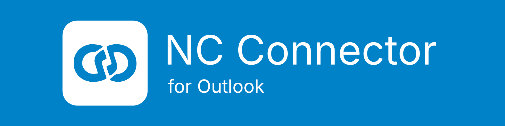
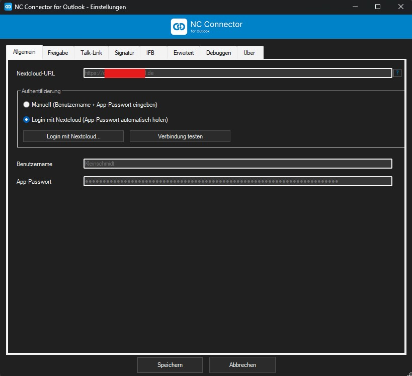
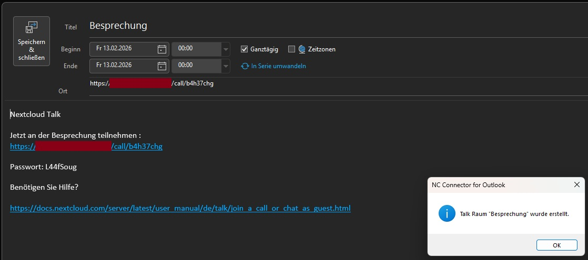
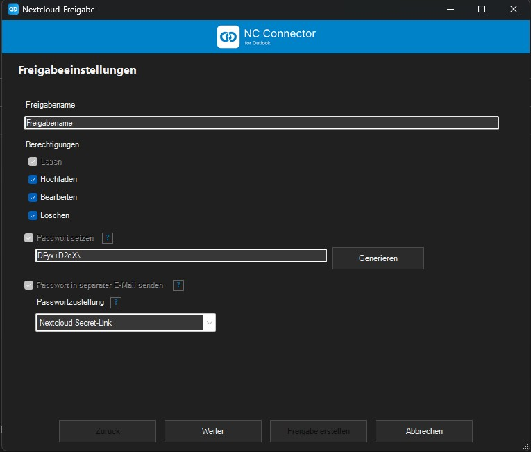
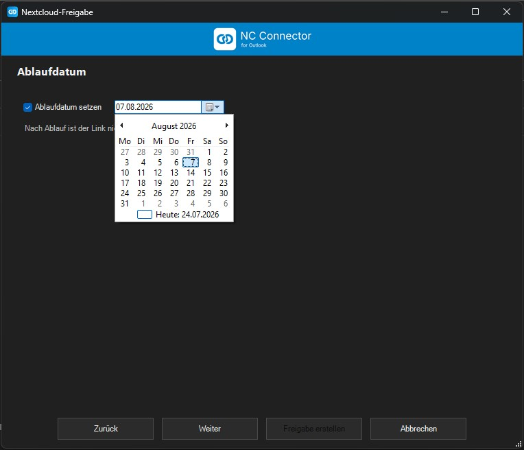
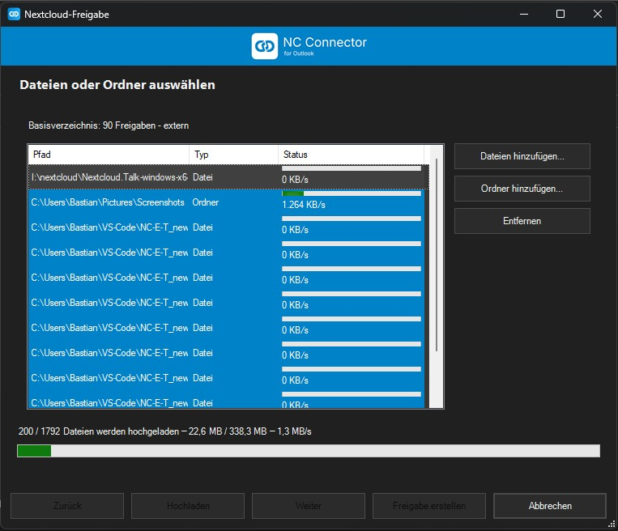
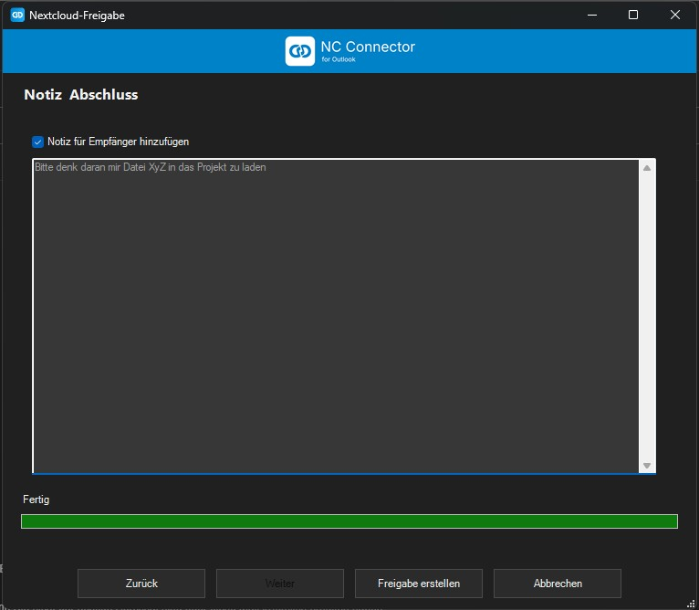
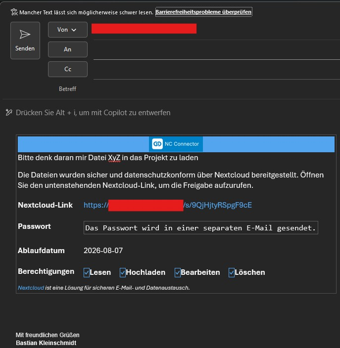

[English](https://github.com/nc-connector/NC_Connector_for_Outlook/blob/main/README.md) | [Deutsch](https://github.com/nc-connector/NC_Connector_for_Outlook/blob/main/README.de.md)
[Admin Guide](https://github.com/nc-connector/NC_Connector_for_Outlook/blob/main/docs/ADMIN.md) | [Development Guide](https://github.com/nc-connector/NC_Connector_for_Outlook/blob/main/docs/DEVELOPMENT.md) | [Translations](https://github.com/nc-connector/NC_Connector_for_Outlook/blob/main/Translations.md) | [VENDOR](https://github.com/nc-connector/NC_Connector_for_Outlook/blob/main/VENDOR.md)

# NC Connector for Outlook

NC Connector brings Nextcloud shares, Talk meetings, managed signatures, and Free/Busy data into Outlook classic. It is built for organizations that keep Outlook and use Nextcloud as their own infrastructure.

## What the add-in does

- create Nextcloud shares directly from new mails, replies, and forwards
- upload large files with Nextcloud chunked WebDAV upload v2 and send links instead of attachments
- control password, expiration date, permissions, and separate password delivery
- send passwords either as plain follow-up mail or as a Nextcloud Secret link
- create and update Talk rooms directly from Outlook appointments
- apply managed email signatures from the optional backend
- provide Outlook Free/Busy data through a local Nextcloud proxy
- write debug logs for support cases, with optional anonymization

## Optional backend

Without the backend, sharing, Talk, and IFB work locally in Outlook. With NC Connector Backend, teams get central management:

- seat assignment and policies
- defaults for sharing, Talk, and signatures
- custom HTML templates for shares, password mails, and Talk invitations
- separate password delivery and optional Nextcloud Secret links
- admin locks for selected options

## Sharing

The sharing wizard uploads files and folders to Nextcloud and inserts the finished share block into the mail. HTML/RTF receives a formatted block, plain text receives a clean text block.

Key points:

- available in compose windows, replies, forwards, and inline replies
- optional expiration date and custom permissions per share
- attachment automation for large attachments or always through NC Connector, with a selectable `ZIP download` (default) or `Nextcloud share page` link target
- one local scan builds a root-relative upload plan; the destination root is created atomically, and attachment automation tries numbered names after a collision without a preliminary server probe
- folders are prepared once; up to three direct transfers run in parallel, files over 20 MiB use chunked upload v2, and small-file sets use DAV bulk upload only when Nextcloud advertises version `1.0` and the complete plan saves at least 20 percent of its requests
- separate password mails are sent only after the primary mail was sent successfully
- if auto-send fails, NC Connector opens a prepared manual password mail

## Talk

An Outlook appointment can create a Nextcloud Talk room directly. The dialog supports lobby, password, room type, and moderation.

NC Connector can sync appointment changes back to the room and add invited attendees. Deleting saved Talk appointments removes rooms only when this behavior is explicitly enabled.

## Signatures

With the backend, Outlook can insert managed email signatures or remove local signatures when the policy says so. NC Connector only touches the signature for the matching sender address. Signatures from other accounts stay untouched.

## Installation

1. Close Outlook.
2. Install the latest MSI from [GitHub Releases](https://github.com/nc-connector/NC_Connector_for_Outlook/releases).
3. Start Outlook and open **NC Connector -> Settings**.
4. Enter the Nextcloud URL.
5. Use Login with Nextcloud or enter an app password manually.
6. Test the connection and save.

Updates are installed by running the new MSI over the existing installation. Personal settings are kept.

## Requirements

- Windows 10 or Windows 11
- Outlook classic 2019 or newer
- .NET Framework 4.7.2
- Nextcloud 32 or newer
- Nextcloud with Files Sharing
- for Talk features: Nextcloud Talk
- for Secret-link password delivery: Nextcloud Secrets and NC Connector Backend

## Language

The UI language follows the Outlook/Office language. Supported languages are documented in [`Translations.md`](https://github.com/nc-connector/NC_Connector_for_Outlook/blob/main/Translations.md). Fallback is German, then English.

Text blocks for shares and Talk can be configured independently from the UI language. Backend templates are used only when the backend is available and the policy allows them.

## Troubleshooting

Debug logs can be enabled in Settings. Files are written to:

`%LOCALAPPDATA%\NC4OL\addin-runtime.log_YYYYMMDD`

Anonymization is enabled by default and masks server URL, credentials, email addresses, and local user path fragments.

For common setup, IFB, and backend policy issues, see the [Admin Guide](https://github.com/nc-connector/NC_Connector_for_Outlook/blob/main/docs/ADMIN.md).

## More documentation

- [Changelog](https://github.com/nc-connector/NC_Connector_for_Outlook/blob/main/CHANGELOG.md)
- [Admin Guide](https://github.com/nc-connector/NC_Connector_for_Outlook/blob/main/docs/ADMIN.md)
- [Development Guide](https://github.com/nc-connector/NC_Connector_for_Outlook/blob/main/docs/DEVELOPMENT.md)
- [Third-party licenses](https://github.com/nc-connector/NC_Connector_for_Outlook/blob/main/VENDOR.md)

## Roadmap

Planned work across Thunderbird, Outlook, and the Backend is tracked in the public [NC Connector Roadmap](https://github.com/orgs/nc-connector/projects/1).

## Screenshots

<strong>Settings</strong>

|  |
| --- |

<strong>Talk link</strong>

|  |  |
| --- | --- |

<strong>Sharing wizard</strong>

|  |  |
| --- | --- |
|  |  |
|  | |

<strong>Internet Free/Busy</strong>

|  |
| --- |

